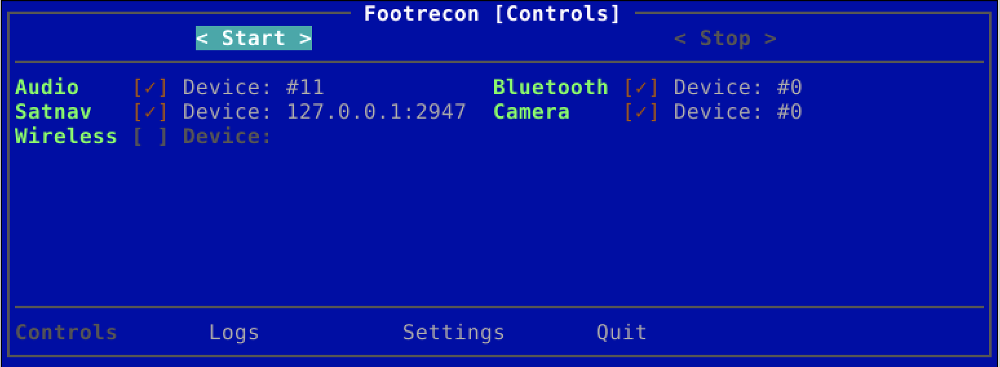

# Footrecon

## About

A mobile all-in-one solution for the initial on-premises information gathering using wifi, bluetooth, camera, audio and GPS. Designed to work with DietPi nad Raspberry Pi out of the box.

## Deployment

As a regular `dietpi` user on a fresh DietPi image run the following:

    dietpi@DietPi:~$ sudo /bin/bash -c "$(curl https://raw.githubusercontent.com/tasooshi/footrecon/main/install/dietpi.sh)"

What the script does:

1. Installs required packages.
1. Enables wireless devices.
1. Installs the project from source.
1. Installs Python requirements.
1. Enables required services.
1. Installs the custom autostart script (running in the foreground as the user specified in `/boot/dietpi.txt`).
1. Reboots.

The output will be stored in the `root` home directory.

## Modules

### Audio

Records from default audio input device and saves to a WAV file.

### Bluetooth

Collects Blutooth addresses, device names and RSSI and stores in a CSV file.

### Camera

Takes picture every 2 seconds and stores as JPEGs.

### Satnav

Stores location data if a gpsd compatible device is available, otherwise the CSV file is empty.

### Wireless

Collects wireless networks details, i.a. SSIDs, encryption, signal strength and MACs in a CSV file.

## Notes

* It takes the first available device from every device group, so e.g. the first available camera if there are two.
