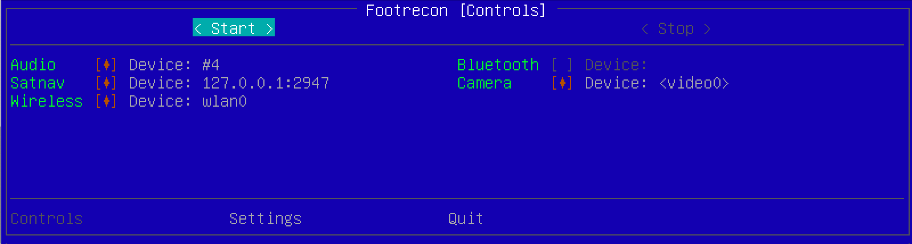

# Footrecon

## About

A mobile all-in-one solution for the initial on-premises information gathering using wifi, bluetooth, camera, audio and GPS. Designed to work with Kali Linux and DietPi.

## Installation

Using the provided installation scripts:

### Kali Linux

As a regular `user`:

    user@localhost:~$ sudo /bin/bash -c "$(curl https://raw.githubusercontent.com/tasooshi/footrecon/main/install/kali.sh)"

### DietPi

As a regular `dietpi` user:

    dietpi@DietPi:~$ sudo /bin/bash -c "$(curl https://raw.githubusercontent.com/tasooshi/footrecon/main/install/dietpi.sh)"

#### Autoboot

You may want to start Footrecon automatically on-boot. In this case it is best to use the `dietpi-autostart` utility. Add the following to your (custom, foreground, autologin) script:

In `/var/lib/dietpi/dietpi-autostart/custom.sh`:

    #!/bin/bash
    /usr/local/share/footrecon/venv/bin/footrecon
    exit 0

For a headless mode and auto-start use the `--headless` argument:

    #!/bin/bash
    /usr/local/share/footrecon/venv/bin/footrecon --headless
    exit 0

### Notes

* It takes the first available device from every group.
* The installation script uses the `sudo` environment variable `$SUDO_USER` as the target user for which the necessary changes should be made. You may want to adjust that to your setup.
